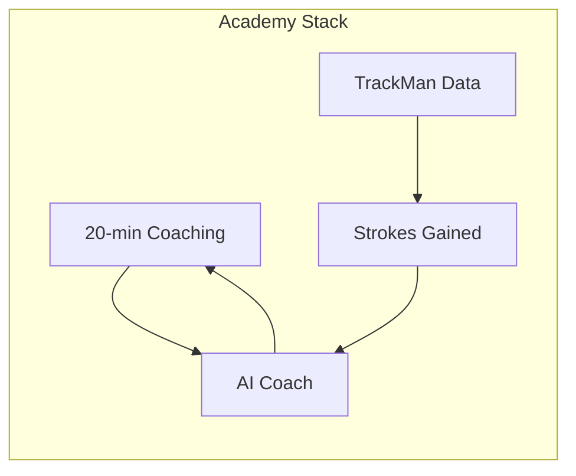
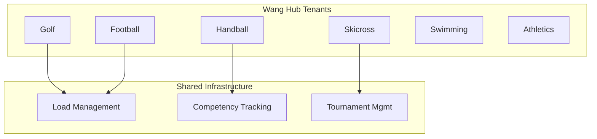
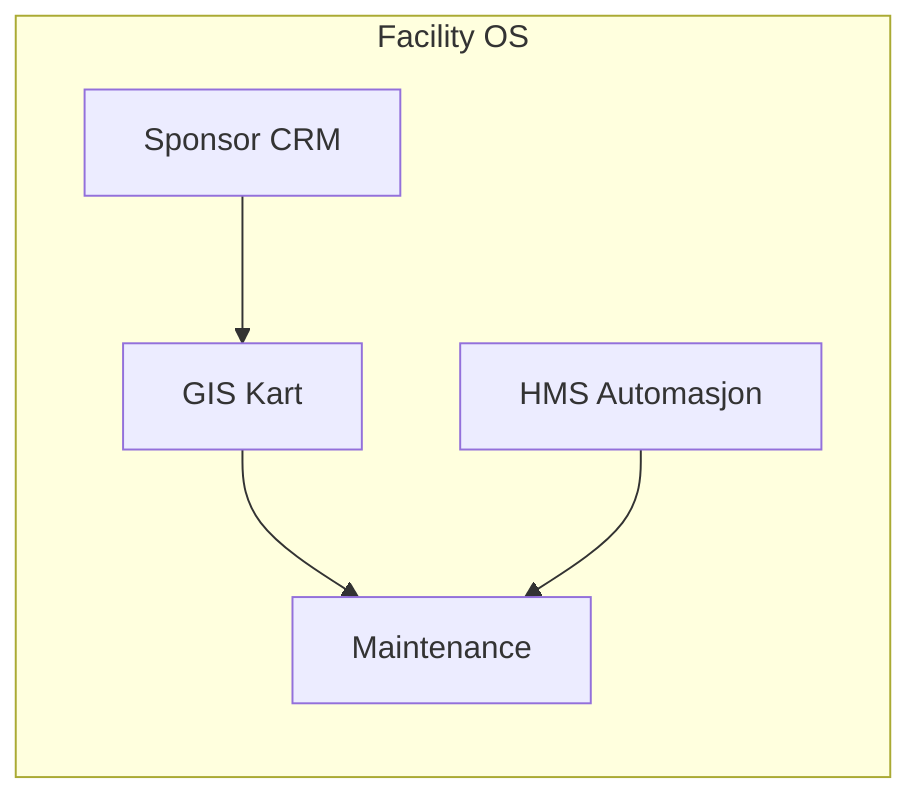
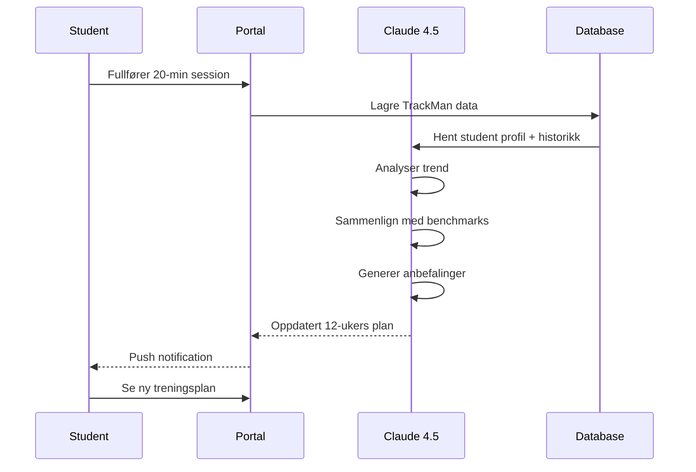

# AK Sports OS — System Architecture

**Version:** 3.0 Heritage Tech | **Date:** April 2026  
**Concept:** "Heritage meets Precision" — Norges ledende idretts- og utviklingsplattform

---

## 1. Executive Summary

AK Sports OS markerer overgangen fra lokal silo-struktur til en **teknologitung plattformaktør**. Økosystemet forener tre tidligere isolerte prosjekter:

| Pillar | Tidligere | Nå |
|--------|-----------|-----|
| **Academy** | AK Golf (golf fokus) | Multi-sport spillerutvikling |
| **Wang Hub** | Manuell organisering | Automatisert multi-sport platform |
| **Facility OS** | Papirbasert drift | B2B SaaS anleggsstyring |

### Visuell Identitet: Heritage Tech

- **Fargepalett:** Heritage Grid — dyp mosegrønn (#2D5A27) + elektrisk lime (#DFFF00)
- **Typografi:** Playfair Display (arv) + Inter (presisjon)
- **UI:** Bento-grid system, mørk modus som standard

---

## 2. High-Level Architecture

```mermaid
graph TB
    subgraph "Client Layer"
        WEB[Next.js 16 App Router]
        PWA[PWA — Installable]
        MOBILE[React Native App]
    end

    subgraph "AK Sports OS Platform"
        direction TB
        
        subgraph "Three Pillars"
            ACADEMY[Academy Module<br/>Spillerutvikling]
            WANG[Wang Hub<br/>Multi-sport org]
            FACILITY[Facility OS<br/>Anleggsdrift]
        end
        
        subgraph "Shared Services"
            AI[AI Engine<br/>Claude 4.5]
            ANALYTICS[Analytics Engine]
            NOTIFICATIONS[Notification Service]
            PAYMENTS[Payment Gateway]
        end
    end

    subgraph "Data Layer"
        POSTGRES[(PostgreSQL<br/>132 models)]
        REDIS[(Redis Cache)]
        VECTOR[(Vector DB<br/>AI embeddings)]
        STORAGE[(File Storage)]
    end

    subgraph "External Integrations"
        TRACKMAN[TrackMan API]
        MATCHI[Matchi Booking]
        DATAGOLF[DataGolf]
        SCHOOL[System for Skole]
        STRIPE[Stripe]
    end

    WEB --> AK Sports OS
    AK Sports OS --> POSTGRES
    AK Sports OS --> REDIS
    
    ACADEMY --> TRACKMAN
    ACADEMY --> DATAGOLF
    WANG --> SCHOOL
    FACILITY --> MATCHI
    PAYMENTS --> STRIPE
```

---

## 3. The Three Pillars

### 3.1 Academy — Spillerutvikling

**Konsept:** Kodifisert metodikk i 132 database-modeller



**Kjernekomponenter:**

| Komponent | Teknologi | Beskrivelse |
|-----------|-----------|-------------|
| Strokes Gained Motor | PostgreSQL + Redis | PGA Tour-benchmarks i sanntid |
| AI Coach | Claude 4.5 API | Auto-justering av 12-ukers planer |
| TrackMan Import | CSV + API | Immutable raw data storage |
| 20-min Scheduler | Custom algo | Optimert for kort, intens coaching |

**Data Model:**
```prisma
model CoachingSession {
  id              String   @id
  type            SessionType @default(TWENTY_MIN)
  studentId       String
  instructorId    String
  
  // 20-min specific
  focusArea       String   // Primary technical focus
  drills          Json     // Assigned drills
  trackManData    Json?    // Linked session data
  
  // AI insights
  aiSummary       String?
  recommendedNext String[] // AI-generated recommendations
  
  createdAt       DateTime @default(now())
}
```

### 3.2 Wang Hub — Multi-Sport Organisering

**Konsept:** Multi-tenant arkitektur for 11 idretter



**Features:**
- **Belastningsstyring:** AI-drevet overbelastningsdeteksjon
- **Kompetansemål:** Integrasjon mot skoleverkets læreplaner
- **Turneringskalender:** Automatisk konfliktdeteksjon

**Competitive Advantage vs Spond:**
| Feature | Spond | Wang Hub |
|---------|-------|----------|
| Fokus | Logistikk | Prestasjon |
| Idretter | Generell | 11 spesialiserte |
| Data | Begrenset | Full analyttikk |
| AI | Nei | Claude 4.5 integrert |

### 3.3 Facility OS — Infrastruktur

**Konsept:** B2B SaaS for anleggsdrift



**Moduler:**
1. **GIS-kartintegrasjon:** Banetilstand, drone-foto overlay
2. **Sponsor-CRM:** Automatisert rapportering til sponsorer
3. **HMS-systemer:** Sjekklister, inspeksjoner, dokumentasjon
4. **Vedlikehold:** Prediktivt vedlikehold basert på bruk

---

## 4. The 20-Min Coaching Revolution

### 4.1 Business Model Transformation

**Gammel modell:**
- 50-min enkelttimer
- Inntekt: ~800 kr/time
- Begrenset av instruktørens tid

**Ny modell:**
- 4 × 20-min coaching per måned
- Pris: 2 000 kr/mnd
- ARR per student: 24 000 kr
- Inkluderer: Full portal, AI-IUP, SG-analyse

### 4.2 Technical Implementation

```typescript
// lib/coaching/twenty-min-model.ts

interface TwentyMinSession {
  id: string;
  studentId: string;
  instructorId: string;
  
  // Compressed format
  focusArea: TechnicalFocus;     // 1 primary focus only
  baselineMetrics: TrackManSnapshot; // Pre-session data
  intervention: CoachingIntervention; // Specific drill/change
  outcomeMetrics: TrackManSnapshot;   // Post-session data
  
  // AI analysis
  deltaAnalysis: MetricDelta[];  // What changed
  retentionScore: number;        // 0-100, how well retained
  nextFocus: TechnicalFocus;     // AI-recommended next session
}

// Scheduling optimization
export function optimizeTwentyMinSlots(
  instructorAvailability: TimeSlot[],
  studentPreferences: Preference[],
  focusAreas: TechnicalFocus[]
): OptimizedSchedule {
  // Group students by focus area for efficiency
  // Minimize instructor context switching
  // Maximize back-to-back sessions
}
```

---

## 5. AI Architecture (Claude 4.5)

### 5.1 AI Coach Integration



### 5.2 Prompt Engineering

```typescript
// lib/ai/prompts/coaching-analysis.ts

export const coachingAnalysisPrompt = `
Du er en PGA Tour-level golfcoach med ekspertise i data-drevet coaching.

STUDENT PROFIL:
- HCP: {{handicap}}
- Alder: {{age}}
- Mål: {{goals}}

SESSION DATA (20-min):
- Fokus: {{focusArea}}
- Før: {{baselineMetrics}}
- Etter: {{outcomeMetrics}}
- Endring: {{deltaMetrics}}

HISTORISK KONTekst:
- Siste 10 sessions: {{sessionHistory}}
- Trend: {{trendDirection}}

OPPGAVE:
1. Analyser hva som fungerte i dagens session
2. Identifiser neste logiske fokusområde
3. Juster 12-ukers planen
4. Gi konkrete drills for neste uke

SVARFORMAT (JSON):
{
  "analysis": "string",
  "keyWins": ["string"],
  "recommendedNextFocus": "string",
  "planAdjustments": [...],
  "drills": [...],
  "confidence": number
}
`;
```

---

## 6. Database Architecture (132 Models)

### 6.1 Model Categories

| Kategori | Antall | Beskrivelse |
|----------|--------|-------------|
| Core | 12 | User, Auth, Permissions |
| Academy | 45 | Coaching, TrackMan, Analytics |
| Wang Hub | 38 | Sports, Load, Competitions |
| Facility | 25 | GIS, Maintenance, Sponsor |
| Shared | 12 | Notifications, Payments, AI |

### 6.2 Key Schema Patterns

```prisma
// Multi-tenant sport isolation
model SportOrganization {
  id      String @id
  sport   Sport  // GOLF, FOOTBALL, HANDBALL, etc.
  tenantId String // Wang school ID
  
  // Sport-specific config
  config  Json
  
  students Student[]
  coaches  Coach[]
}

// 20-min session tracking
model TwentyMinSession {
  id            String   @id
  studentId     String
  instructorId  String
  
  // Time boxing
  scheduledAt   DateTime
  actualStart   DateTime?
  actualEnd     DateTime?
  
  // Focus
  primaryFocus  String
  secondaryFocus String?
  
  // Data links
  preTrackManId String?
  postTrackManId String?
  
  // AI
  aiSummary     String?
  nextSessionFocus String?
  
  // Outcome
  studentRating Int?     // 1-10
  coachNotes    String?
}
```

---

## 7. Exit Strategy & Valuation

### 7.1 Value Creation Metrics

| Metric | 2025 | 2026 Mål | 2027 Mål |
|--------|------|----------|----------|
| ARR | 2M NOK | 8M NOK | 20M NOK |
| Students | 200 | 500 | 1,200 |
| Sports | 1 | 11 | 25 |
| EBITDA Margin | 15% | 35% | 45% |

### 7.2 Valuation Model

```
Valuation = EBITDA × Multiple

2026 Scenario:
- EBITDA: 6M NOK
- Multiple: 12x (SaaS + Heritage brand)
- Valuation: 72M NOK

Multiple Drivers:
- Recurring Revenue (ARR): +4x premium
- Proprietary IP (132 models): +2x premium  
- Heritage Brand: +2x premium
- Market Position: +4x premium
```

### 7.3 Exit Options

| Acquirer Type | Motivation | Sannsynlighet |
|---------------|------------|---------------|
| Tech Giants (Microsoft, Apple) | Sports AI platform | Medium |
| Luxury Sports Chains | Brand expansion | High |
| Private Equity | SaaS cash flow | High |
| Nordic EdTech | School integration | Medium |

---

## 8. Implementation Roadmap 2026

### Q2 2026: Visual Rebrand
- [ ] Implementere Heritage Green-palett
- [ ] Dark mode default
- [ ] Bento-grid UI system
- [ ] Brand asset library

### Q3 2026: 20-min Concept Launch
- [ ] Konvertere GFGK-medlemmer
- [ ] AI Coach v1.0
- [ ] Subscription billing
- [ ] TrackMan auto-sync

### Q4 2026: Beta-lansering (Club OS)
- [ ] 100 pilot-idrettslag
- [ ] Wang Hub full release
- [ ] Facility OS beta
- [ ] Multi-sport analytics

---

## 9. Technology Stack

| Layer | Technology | Rationale |
|-------|------------|-----------|
| **Frontend** | Next.js 16 + React 19 | App Router, Server Components |
| **Styling** | Tailwind CSS v4 | Heritage design tokens |
| **Database** | PostgreSQL (Neon) | 132 models, vector extension |
| **Cache** | Redis (Upstash) | Session, real-time data |
| **AI** | Claude 4.5 (Anthropic) | Best-in-class reasoning |
| **Auth** | Supabase Auth | Multi-tenant ready |
| **Payments** | Stripe | Subscription management |
| **Monitoring** | Vercel Analytics + Clarity | Performance tracking |

---

## 10. Competitive Moats

1. **Data Moat:** 132 interconnected models → switching cost
2. **AI Moat:** Fine-tuned Claude 4.5 on proprietary data
3. **Brand Moat:** Heritage Tech aesthetic → premium positioning
4. **Network Moat:** Wang Hub multi-sport → ecosystem lock-in
5. **Regulatory Moat:** School integration → long-term contracts

---

**Conclusion:**

AK Sports OS er ikke bare en coaching-virksomhet; det er et **operativt system for fremtidens idrett**. Ved å forene dyp faglig kunnskap med luksuriøs visuell profil og skalerbar SaaS-arkitektur, skaper vi en unik posisjon i markedet — bygget for å generere massiv verdi for både brukere og eiere.

*"Heritage meets Precision"*
