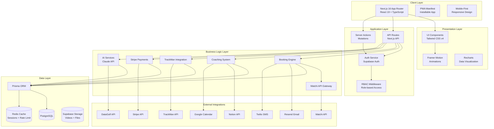
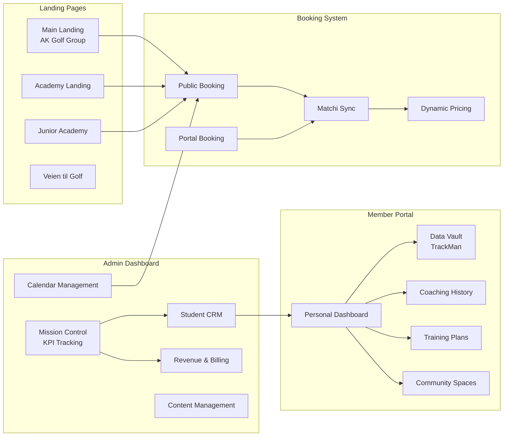
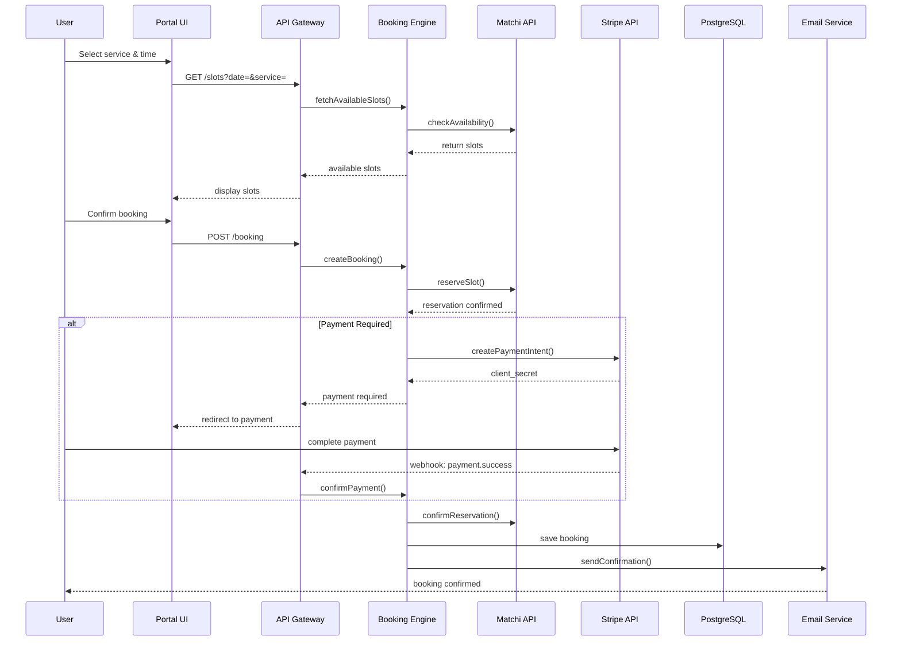
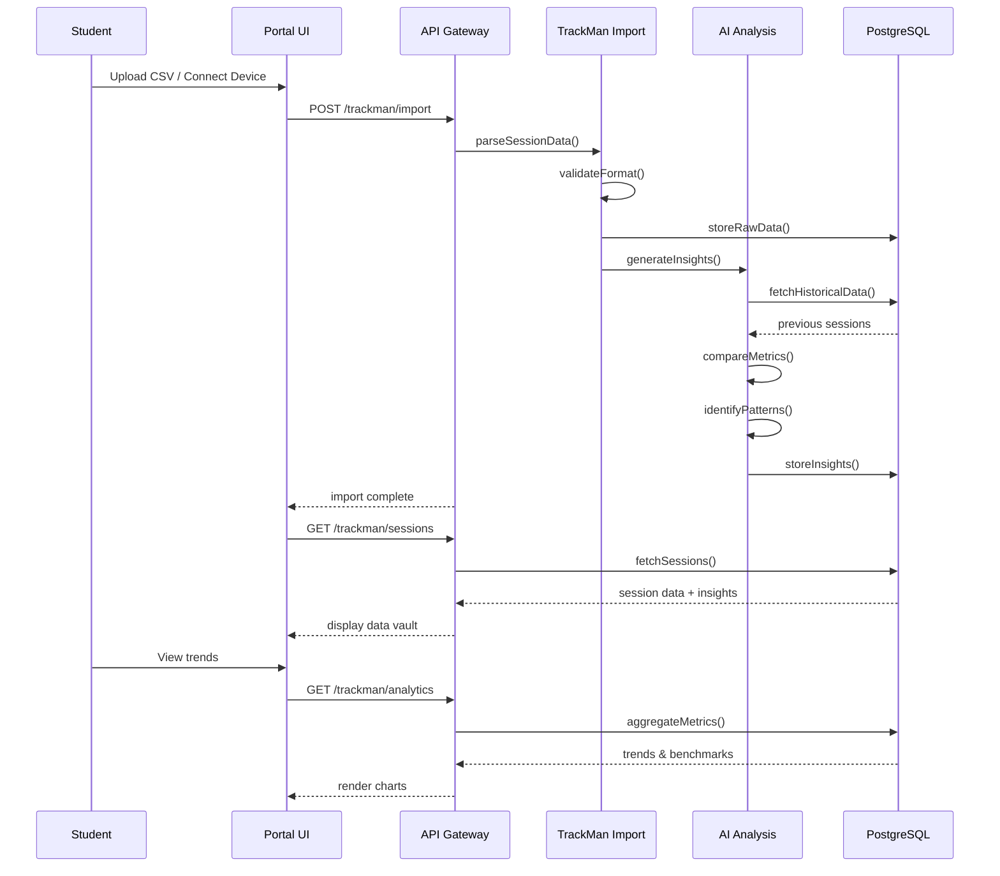
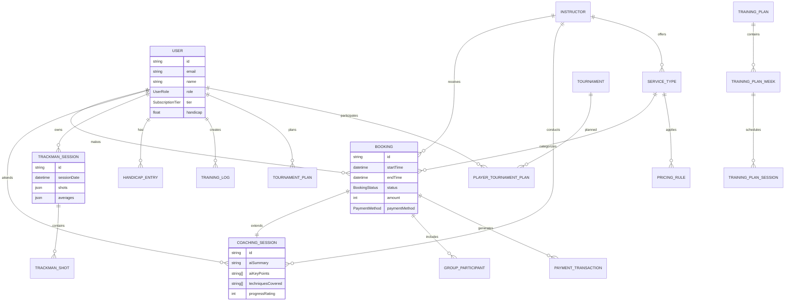
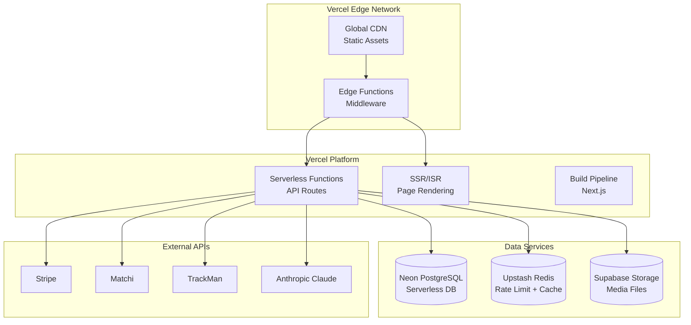
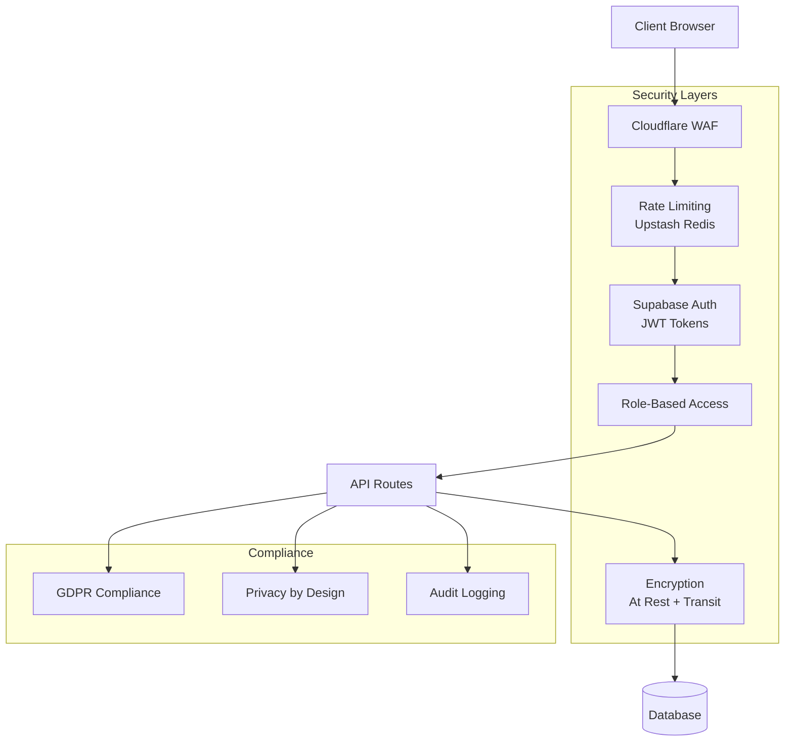

# AK Golf Platform — System Architecture Map

**Version:** 2.0 | **Date:** April 2026  
**Concept:** "Aktiv livet ut" (Active for Life) — Inclusive golf ecosystem from ages 3 to 90+

---

## 1. High-Level Architecture Overview



---

## 2. Module Interaction Diagram



---

## 3. Data Flow: Booking with Matchi Integration



---

## 4. TrackMan Data Integration Flow



---

## 5. Component Hierarchy

```mermaid
graph TD
    subgraph "Root Layout"
        RL[layout.tsx]
    end

    subgraph "Route Groups"
        RG_MARKETING[(marketing)]
        RG_PORTAL[(portal)]
        RG_API[(api)]
    end

    subgraph "Marketing Routes"
        M_HOME[page.tsx<br/>Hero + Stats]
        M_ACADEMY[academy/page.tsx]
        M_JUNIOR[junior-academy/page.tsx]
        M_BOOKING[booking/page.tsx]
    end

    subgraph "Portal Routes"
        P_LAYOUT[(dashboard)/layout.tsx<br/>Sidebar + Auth]
        P_DASH[(dashboard)/page.tsx]
        P_ADMIN[admin/analytics/page.tsx]
        P_TRACKMAN[trackman/page.tsx]
        P_BOOKINGS[bookinger/page.tsx]
    end

    subgraph "Shared Components"
        C_UI[components/ui/]
        C_PORTAL[components/portal/]
        C_WEBSITE[components/website/]
    end

    RL --> RG_MARKETING
    RL --> RG_PORTAL
    RL --> RG_API
    
    RG_MARKETING --> M_HOME
    RG_MARKETING --> M_ACADEMY
    RG_MARKETING --> M_JUNIOR
    RG_MARKETING --> M_BOOKING
    
    RG_PORTAL --> P_LAYOUT
    P_LAYOUT --> P_DASH
    P_LAYOUT --> P_ADMIN
    P_LAYOUT --> P_TRACKMAN
    P_LAYOUT --> P_BOOKINGS
    
    M_HOME --> C_WEBSITE
    M_ACADEMY --> C_WEBSITE
    P_DASH --> C_PORTAL
    P_ADMIN --> C_PORTAL
```

---

## 6. Database Schema Relationships (Simplified)



---

## 7. Infrastructure & Deployment



---

## 8. Security Architecture



---

## 9. API Gateway Structure

| Endpoint | Method | Description | Auth |
|----------|--------|-------------|------|
| `/api/portal/public/*` | GET | Public data (slots, services) | None |
| `/api/portal/bookings/*` | POST/PUT | Booking CRUD operations | Required |
| `/api/portal/trackman/*` | POST/GET | TrackMan data import/query | Required |
| `/api/portal/ai/*` | POST | AI coaching analysis | Required |
| `/api/portal/admin/*` | ALL | Admin-only operations | Admin only |
| `/api/portal/webhooks/stripe` | POST | Stripe webhooks | Signature |
| `/api/portal/cron/*` | GET | Scheduled tasks | Cron secret |

---

## 10. Technology Stack Summary

| Layer | Technology | Purpose |
|-------|------------|---------|
| **Frontend** | Next.js 16, React 19, TypeScript | App framework |
| **Styling** | Tailwind CSS v4, CSS Variables | Design system |
| **Animation** | Framer Motion 12.x | UI animations |
| **Auth** | Supabase Auth | Identity management |
| **Database** | PostgreSQL (Neon), Prisma ORM | Data persistence |
| **Cache** | Upstash Redis | Session + rate limiting |
| **Storage** | Supabase Storage | File uploads |
| **Payments** | Stripe | Billing & subscriptions |
| **Email** | Resend, React Email | Transactional emails |
| **SMS** | Twilio | Booking reminders |
| **AI** | Anthropic Claude | Coaching insights |
| **External** | Matchi API, TrackMan API, DataGolf | Golf integrations |

---

**Next Steps:** See `/docs/IMPLEMENTATION.md` for detailed component specifications and `/docs/DATA_MODEL.md` for complete database schema.
