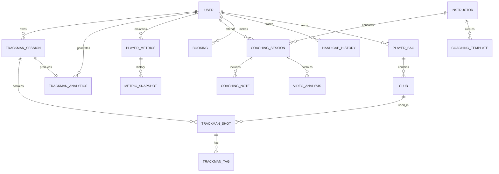
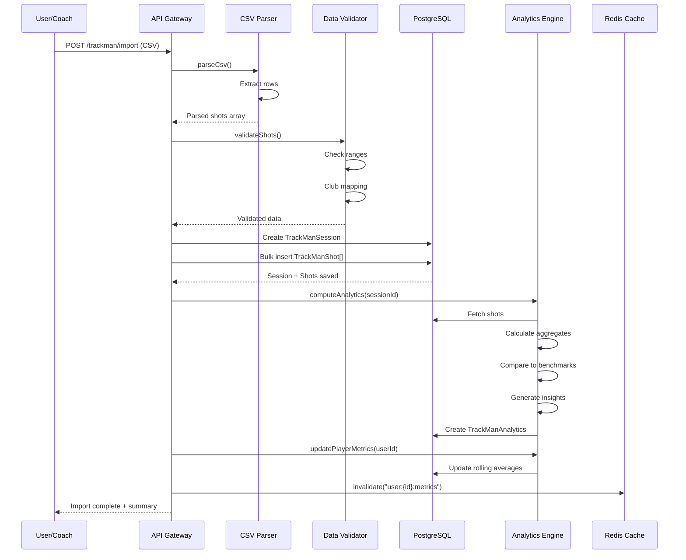

# AK Golf Platform — Data Model Specification

**Version:** 2.0 | **Date:** April 2026  
**Focus:** Player Portal with TrackMan Integration

---

## 1. Overview

This document specifies the data model for the AK Golf Player Portal, with particular emphasis on TrackMan data integration, performance analytics, and the "Data Vault" concept for storing and retrieving golf metrics.

### Key Principles

1. **Immutable Raw Data:** TrackMan CSV imports are stored as-is for auditability
2. **Computed Metrics:** Derived statistics (averages, trends) are calculated on-demand or cached
3. **Privacy-First:** All personal data is GDPR-compliant with explicit consent tracking
4. **Performance:** Heavy analytics queries use materialized views or Redis caching

---

## 2. Entity Relationship Diagram



---

## 3. Core Entities

### 3.1 User (Extended for Portal)

```prisma
model User {
  id                    String    @id @default(cuid())
  email                 String    @unique
  name                  String?
  phone                 String?
  
  // Portal-specific fields
  role                  UserRole  @default(STUDENT)
  subscriptionTier      SubscriptionTier @default(VISITOR)
  
  // Profile
  handicap              Float?
  handicapUpdatedAt     DateTime?
  dateOfBirth           DateTime?
  gender                Gender?
  dominantHand          Hand      @default(RIGHT)
  
  // TrackMan integration
  trackManId            String?   @unique  // External TrackMan user ID
  trackManApiToken      String?   // Encrypted API token
  trackManSyncEnabled   Boolean   @default(false)
  lastTrackManSync      DateTime?
  
  // Consent & GDPR
  dataConsentGiven      Boolean   @default(false)
  dataConsentDate       DateTime?
  marketingConsent      Boolean   @default(false)
  
  // Relations
  trackManSessions      TrackManSession[]
  playerMetrics         PlayerMetrics?
  handicapHistory       HandicapHistory[]
  coachingSessions      CoachingSession[]
  bookings              Booking[]
  playerBag             PlayerBag?
  
  createdAt             DateTime  @default(now())
  updatedAt             DateTime  @updatedAt
}
```

### 3.2 TrackMan Session

Stores a complete TrackMan practice session with all shots.

```prisma
model TrackManSession {
  id                    String            @id @default(cuid())
  userId                String
  
  // Session metadata
  sessionDate           DateTime
  sessionType           TrackManSessionType @default(PRACTICE)
  location              String?           // Driving range name
  weather               String?           // Weather conditions
  temperature           Float?            // Celsius
  windSpeed             Float?            // m/s
  windDirection         String?           // N, NE, E, etc.
  
  // TrackMan specific
  trackManSessionId     String?           @unique  // External ID from TrackMan
  importSource          ImportSource      @default(CSV_UPLOAD)
  rawCsvData            String?           // Stored for audit/re-import
  
  // Computed aggregates (updated after import)
  totalShots            Int               @default(0)
  clubsUsed             String[]          // Array of club names
  focusClub             String?           // Primary club for session
  
  // Relations
  user                  User              @relation(fields: [userId], references: [id], onDelete: Cascade)
  shots                 TrackManShot[]
  analytics             TrackManAnalytics?
  
  createdAt             DateTime          @default(now())
  updatedAt             DateTime          @updatedAt
  
  @@index([userId, sessionDate])
  @@index([trackManSessionId])
}

enum TrackManSessionType {
  PRACTICE
  LESSON
  FITTING
  COMPETITION
  TRACKING
}

enum ImportSource {
  CSV_UPLOAD
  API_SYNC
  MANUAL_ENTRY
  COACH_IMPORT
}
```

### 3.3 TrackMan Shot (Individual Shot Data)

Stores granular data for each shot in a session.

```prisma
model TrackManShot {
  id                    String            @id @default(cuid())
  sessionId             String
  
  // Shot sequence
  shotNumber            Int
  ballNumber            Int               @default(1)  // For multi-ball sessions
  
  // Club information
  club                  String            // e.g., "Driver", "7 Iron"
  clubCategory          ClubCategory      // DRIVER, WOOD, HYBRID, IRON, WEDGE, PUTTER
  
  // Ball data (from TrackMan)
  ballSpeed             Float?            // mph
  launchAngle           Float?            // degrees
  launchDirection       Float?            // degrees (horizontal)
  spinRate              Float?            // rpm
  spinAxis              Float?            // degrees
  backSpin              Float?            // rpm
  sideSpin              Float?            // rpm
  
  // Flight data
  carryDistance         Float?            // yards
  totalDistance         Float?            // yards
  maxHeight             Float?            // feet
  landingAngle          Float?            // degrees
  hangTime              Float?            // seconds
  
  // Dispersion
  offlineDistance       Float?            // yards from target line
  curveDistance         Float?            // yards of curve
  
  // Strike quality
  smashFactor           Float?            // ball speed / club speed
  
  // Club data (if available)
  clubSpeed             Float?            // mph
  attackAngle           Float?            // degrees
  clubPath              Float?            // degrees
  faceAngle             Float?            // degrees
  faceToPath            Float?            // degrees
  dynamicLoft           Float?            // degrees
  
  // Classification (AI/computed)
  shotQuality           ShotQuality?      // GOOD, FAIR, POOR, DUFF, TOP, SHANK, etc.
  shotShape             ShotShape?        // DRAW, FADE, STRAIGHT, HOOK, SLICE
  missType              MissType?         // LEFT, RIGHT, SHORT, LONG
  
  // User/Coach annotations
  notes                 String?
  tags                  TrackManTag[]
  videoUrl              String?           // Link to swing video
  
  // Relations
  session               TrackManSession   @relation(fields: [sessionId], references: [id], onDelete: Cascade)
  clubRef               Club?             @relation(fields: [clubId], references: [id])
  clubId                String?
  
  createdAt             DateTime          @default(now())
  
  @@index([sessionId, shotNumber])
  @@index([clubCategory])
  @@index([carryDistance])
}

enum ClubCategory {
  DRIVER
  WOOD_3
  WOOD_5
  HYBRID
  IRON_2
  IRON_3
  IRON_4
  IRON_5
  IRON_6
  IRON_7
  IRON_8
  IRON_9
  PW
  GW
  SW
  LW
  PUTTER
}

enum ShotQuality {
  EXCELLENT
  GOOD
  FAIR
  POOR
  DUFF
  TOP
  SHANK
  WHIFF
}

enum ShotShape {
  STRAIGHT
  DRAW
  FADE
  HOOK
  SLICE
  PULL
  PUSH
}

enum MissType {
  LEFT
  RIGHT
  SHORT
  LONG
  CENTER
}
```

### 3.4 TrackMan Analytics (Computed Session Metrics)

Pre-computed analytics for quick dashboard display.

```prisma
model TrackManAnalytics {
  id                    String            @id @default(cuid())
  sessionId             String            @unique
  
  // Aggregates by club category
  driverStats           Json?             // { avgBallSpeed, avgCarry, consistency, etc. }
  ironStats             Json?             // Aggregated iron metrics
  wedgeStats            Json?             // Wedge-specific metrics
  
  // Overall session metrics
  avgBallSpeed          Float?
  maxBallSpeed          Float?
  avgCarryDistance      Float?
  maxCarryDistance      Float?
  
  // Consistency metrics
  ballSpeedConsistency  Float?            // Coefficient of variation
  distanceConsistency   Float?            // Coefficient of variation
  
  // Shot pattern analysis
  shotShapeDistribution Json?             // { straight: 40%, draw: 30%, fade: 30% }
  missPattern           Json?             // { left: 20%, right: 30%, center: 50% }
  
  // Strike quality
  sweetSpotPercentage   Float?            // % of shots with smashFactor > 1.45
  
  // Trends (compared to previous sessions)
  trendBallSpeed        TrendDirection?
  trendDistance         TrendDirection?
  trendConsistency      TrendDirection?
  
  // AI/Coach insights
  generatedInsights     String[]          // Auto-generated observations
  recommendedFocus      String[]          // Suggested practice areas
  
  // Relations
  session               TrackManSession   @relation(fields: [sessionId], references: [id], onDelete: Cascade)
  
  createdAt             DateTime          @default(now())
  updatedAt             DateTime          @updatedAt
}

enum TrendDirection {
  IMPROVING
  STABLE
  DECLINING
}
```

### 3.5 Player Metrics (Longitudinal Tracking)

Rolling averages and benchmarks for the player.

```prisma
model PlayerMetrics {
  id                    String            @id @default(cuid())
  userId                String            @unique
  
  // Last 10 sessions averages
  last10DriverSpeed     Float?
  last10DriverCarry     Float?
  last10SevenIronSpeed  Float?
  last10SevenIronCarry  Float?
  
  // Personal bests
  pbBallSpeed           Float?
  pbCarryDistance       Float?
  pbDriverDistance      Float?
  
  // Benchmarks vs. handicap
  expectedDriverSpeed   Float?            // Based on handicap
  expectedSevenIronCarry Float?           // Based on handicap
  
  // Gaps (potential analysis)
  speedGapToPotential   Float?            // How much more speed is possible
  
  // Consistency trends
  consistencyScore      Int?              // 0-100 score
  
  // Relations
  user                  User              @relation(fields: [userId], references: [id], onDelete: Cascade)
  snapshots             MetricSnapshot[]  // Historical snapshots
  
  updatedAt             DateTime          @updatedAt
}

model MetricSnapshot {
  id                    String            @id @default(cuid())
  playerMetricsId       String
  
  snapshotDate          DateTime
  
  // Snapshot data
  driverSpeed           Float?
  driverCarry           Float?
  sevenIronCarry        Float?
  consistencyScore      Int?
  
  // Relations
  playerMetrics         PlayerMetrics     @relation(fields: [playerMetricsId], references: [id], onDelete: Cascade)
  
  @@index([playerMetricsId, snapshotDate])
}
```

### 3.6 Player Bag (Club Management)

Tracks the player's clubs and their performance characteristics.

```prisma
model PlayerBag {
  id                    String            @id @default(cuid())
  userId                String            @unique
  
  name                  String            @default("My Bag")
  isActive              Boolean           @default(true)
  
  // Relations
  user                  User              @relation(fields: [userId], references: [id], onDelete: Cascade)
  clubs                 Club[]
  
  createdAt             DateTime          @default(now())
  updatedAt             DateTime          @updatedAt
}

model Club {
  id                    String            @id @default(cuid())
  bagId                 String
  
  // Club specification
  name                  String            // e.g., "TaylorMade Stealth 2"
  brand                 String?
  model                 String?
  category              ClubCategory
  loft                  Float?            // degrees
  shaft                 String?
  flex                  String?
  
  // Performance profile (from TrackMan data)
  avgBallSpeed          Float?
  avgCarryDistance      Float?
  avgTotalDistance      Float?
  avgSpinRate           Float?
  avgLaunchAngle        Float?
  
  // Gapping
  gapToNextClub         Float?            // yards difference to next club
  
  // Relations
  bag                   PlayerBag         @relation(fields: [bagId], references: [id], onDelete: Cascade)
  shots                 TrackManShot[]
  
  @@index([bagId, category])
}
```

---

## 4. Integration Points

### 4.1 TrackMan CSV Import Schema

Expected columns in TrackMan CSV export:

```typescript
interface TrackManCsvRow {
  // Required fields
  "Club": string;              // e.g., "Driver", "7 Iron"
  "Ball Speed": number;        // mph
  "Launch Angle": number;      // degrees
  "Spin Rate": number;         // rpm
  "Carry": number;             // yards
  
  // Optional fields
  "Total Distance"?: number;   // yards
  "Offline"?: number;          // yards
  "Peak Height"?: number;      // feet
  "Landing Angle"?: number;    // degrees
  "Hang Time"?: number;        // seconds
  "Smash Factor"?: number;     // ratio
  "Club Speed"?: number;       // mph
  "Attack Angle"?: number;     // degrees
  "Club Path"?: number;        // degrees
  "Face Angle"?: number;       // degrees
  "Face to Path"?: number;     // degrees
  "Spin Axis"?: number;        // degrees
}
```

### 4.2 Data Flow: Import to Analytics



---

## 5. API Endpoints

### 5.1 TrackMan Endpoints

| Endpoint | Method | Description | Auth |
|----------|--------|-------------|------|
| `/api/portal/trackman/import` | POST | Import CSV session | Required |
| `/api/portal/trackman/sessions` | GET | List user sessions | Required |
| `/api/portal/trackman/sessions/:id` | GET | Get session details | Required |
| `/api/portal/trackman/sessions/:id/shots` | GET | Get all shots | Required |
| `/api/portal/trackman/analytics` | GET | Get computed analytics | Required |
| `/api/portal/trackman/trends` | GET | Get trends over time | Required |
| `/api/portal/trackman/benchmarks` | GET | Get handicap benchmarks | Required |

### 5.2 Request/Response Examples

#### Import Session

```http
POST /api/portal/trackman/import
Content-Type: multipart/form-data

{
  "file": <CSV_FILE>,
  "sessionDate": "2026-04-07T10:00:00Z",
  "location": "GFGK Driving Range",
  "sessionType": "PRACTICE"
}
```

```json
{
  "success": true,
  "sessionId": "sess_abc123",
  "summary": {
    "totalShots": 87,
    "clubsUsed": ["Driver", "7 Iron", "PW"],
    "avgBallSpeed": 148.5,
    "importedAt": "2026-04-07T12:34:56Z"
  },
  "analytics": {
    "driverAvgCarry": 245.3,
    "trendDirection": "IMPROVING"
  }
}
```

#### Get Session Analytics

```http
GET /api/portal/trackman/sessions/sess_abc123/analytics
```

```json
{
  "sessionId": "sess_abc123",
  "sessionDate": "2026-04-07",
  "aggregates": {
    "driver": {
      "shots": 24,
      "avgBallSpeed": 158.2,
      "avgCarry": 258.4,
      "consistency": 92.5,
      "bestShot": 285.3
    },
    "irons": {
      "sevenIron": {
        "shots": 18,
        "avgCarry": 168.3,
        "avgSpin": 6200
      }
    }
  },
  "insights": [
    "Driver ball speed up 3.2 mph vs. last session",
    "Consistency improved on approach shots",
    "Consider working on wedge distance control"
  ],
  "trends": {
    "ballSpeed": "IMPROVING",
    "consistency": "STABLE",
    "distance": "IMPROVING"
  }
}
```

---

## 6. Data Vault Concept

The "Data Vault" is the player's centralized repository for all golf-related data:

### 6.1 Vault Components

| Component | Source | Update Frequency |
|-----------|--------|------------------|
| TrackMan Sessions | CSV Import / API | Per session |
| Handicap History | NGF / Manual | Monthly |
| Coaching Notes | Coach input | Per lesson |
| Video Analysis | Upload / CoachNow | Per lesson |
| Round Stats | Manual / Upgame | Per round |
| Training Log | Player input | Daily |

### 6.2 Vault Access Patterns

```typescript
// Data Vault Query Interface
interface DataVault {
  // Get complete player profile
  getPlayerProfile(userId: string): Promise<PlayerProfile>;
  
  // Get time-series data for charts
  getMetricHistory(
    userId: string,
    metric: string,
    range: DateRange
  ): Promise<MetricDataPoint[]>;
  
  // Compare to benchmarks
  getBenchmarkComparison(
    userId: string,
    metric: string
  ): Promise<BenchmarkComparison>;
  
  // Export all data (GDPR)
  exportPlayerData(userId: string): Promise<DataExport>;
}
```

---

## 7. Performance Considerations

### 7.1 Database Indexes

```sql
-- Essential indexes for TrackMan queries
CREATE INDEX idx_trackman_shots_session ON "TrackManShot"("sessionId");
CREATE INDEX idx_trackman_shots_club ON "TrackManShot"("clubCategory");
CREATE INDEX idx_trackman_sessions_user_date ON "TrackManSession"("userId", "sessionDate" DESC);
CREATE INDEX idx_trackman_analytics_session ON "TrackManAnalytics"("sessionId");

-- GIN index for JSON analytics fields
CREATE INDEX idx_trackman_analytics_driver ON "TrackManAnalytics" USING GIN ("driverStats");
```

### 7.2 Caching Strategy

| Data Type | Cache Key | TTL | Strategy |
|-----------|-----------|-----|----------|
| Session list | `user:{id}:sessions` | 5 min | Cache-aside |
| Analytics | `session:{id}:analytics` | 1 hour | Write-through |
| Player metrics | `user:{id}:metrics` | 15 min | Cache-aside |
| Benchmarks | `benchmarks:{handicap}` | 1 day | Write-through |

### 7.3 Materialized Views

```sql
-- Pre-computed player averages by club
CREATE MATERIALIZED VIEW player_club_averages AS
SELECT 
  "userId",
  club,
  AVG("ballSpeed") as avg_ball_speed,
  AVG("carryDistance") as avg_carry,
  COUNT(*) as shot_count,
  MAX("carryDistance") as max_carry
FROM "TrackManShot"
JOIN "TrackManSession" ON "TrackManShot"."sessionId" = "TrackManSession".id
WHERE "sessionDate" > NOW() - INTERVAL '90 days'
GROUP BY "userId", club;

-- Refresh strategy: Daily or after import
CREATE INDEX idx_club_averages_user ON player_club_averages("userId");
```

---

## 8. GDPR & Data Retention

### 8.1 Consent Management

```prisma
model DataConsent {
  id                    String    @id @default(cuid())
  userId                String
  
  consentType           ConsentType
  granted               Boolean
  grantedAt             DateTime?
  revokedAt             DateTime?
  
  // Version tracking
  policyVersion         String
  ipAddress             String?
  userAgent             String?
}

enum ConsentType {
  TRACKMAN_DATA_STORAGE
  PERFORMANCE_ANALYTICS
  COACH_ACCESS
  VIDEO_STORAGE
  DATA_EXPORT
}
```

### 8.2 Retention Policy

| Data Type | Retention | Action After |
|-----------|-----------|--------------|
| Raw TrackMan CSV | 2 years | Archive to cold storage |
| Shot-level data | 5 years | Aggregate & anonymize |
| Session summaries | Indefinite | None |
| Video recordings | 1 year | Delete unless requested |
| Deleted accounts | 30 days | Full purge |

---

## 9. Migration Guide

### From Existing Schema

```sql
-- Add new TrackMan fields to existing tables
ALTER TABLE "TrackmanSession" ADD COLUMN IF NOT EXISTS "trackManSessionId" TEXT;
ALTER TABLE "TrackmanSession" ADD COLUMN IF NOT EXISTS "importSource" TEXT DEFAULT 'CSV_UPLOAD';
ALTER TABLE "TrackmanSession" ADD COLUMN IF NOT EXISTS "rawCsvData" TEXT;

-- Create new analytics table
CREATE TABLE IF NOT EXISTS "TrackManAnalytics" (
  -- ... (see schema above)
);

-- Migrate existing data
INSERT INTO "TrackManAnalytics" ("sessionId", "totalShots", "createdAt")
SELECT id, (SELECT COUNT(*) FROM "TrackmanSession" ts WHERE ts.id = "TrackmanSession".id), NOW()
FROM "TrackmanSession";
```

---

**Next Steps:**
1. Run database migrations
2. Update Prisma client
3. Deploy TrackMan import service
4. Configure Redis caching layer
