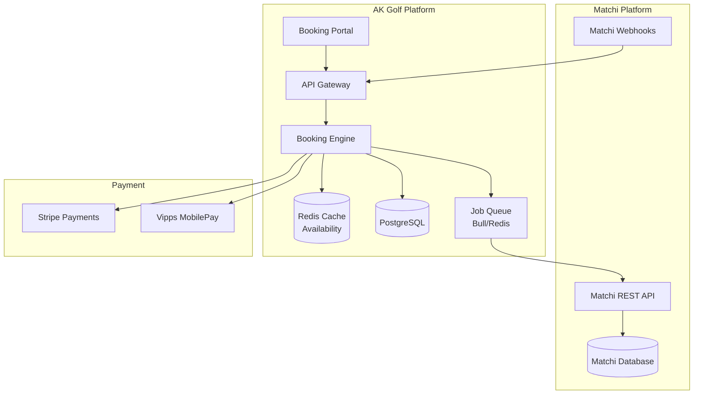
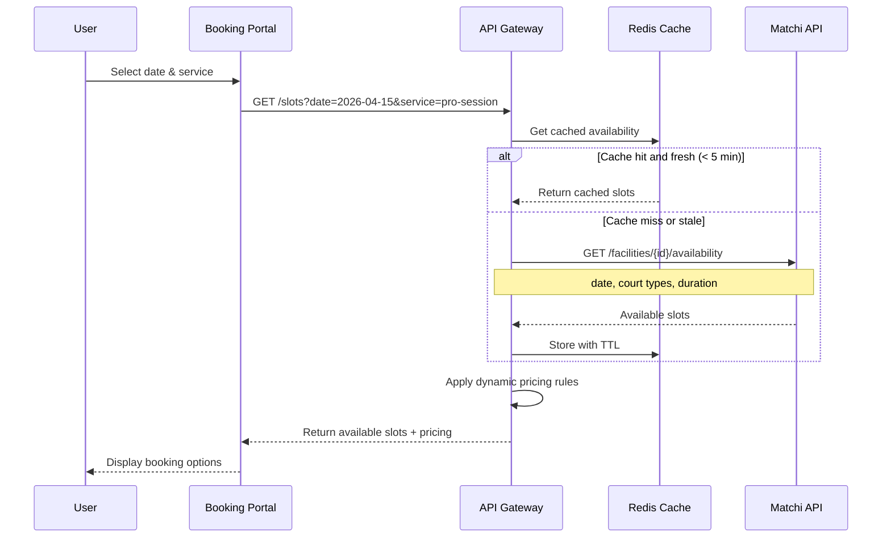
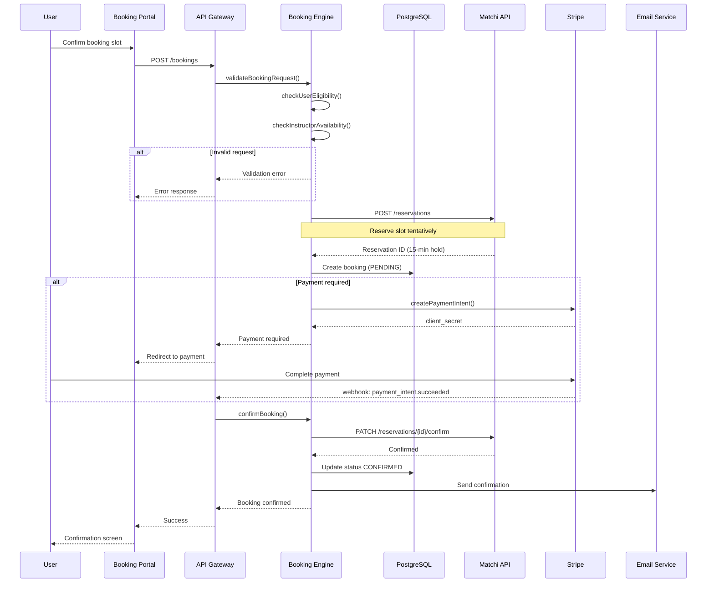
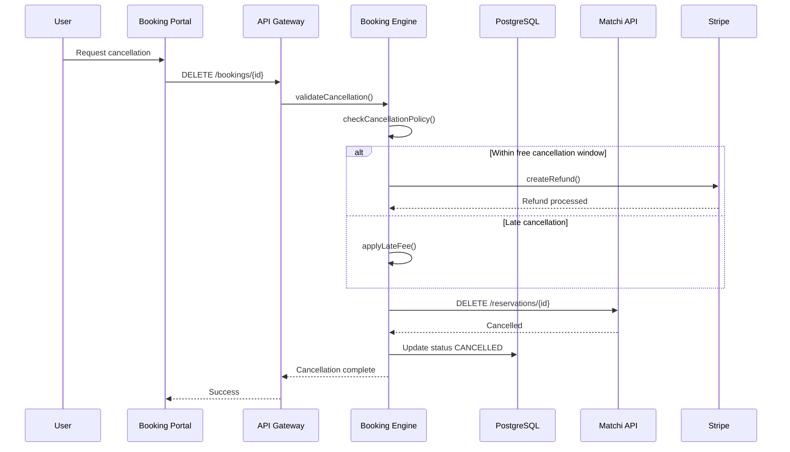

# AK Golf Platform — Matchi Booking Integration

**Version:** 1.0 | **Date:** April 2026  
**Purpose:** Real-time booking integration with Matchi for court/bay availability and "Pro-session" scheduling

---

## 1. Overview

Matchi integration enables AK Golf to:

1. **Display real-time availability** from Matchi within the AK Golf portal
2. **Sync bookings bidirectionally** — bookings made in AK Golf appear in Matchi, and vice versa
3. **Apply dynamic pricing** — twilight rates, member discounts, surge pricing
4. **Handle "Pro-sessions"** — instructor-led bookings with special Matchi reservation types

---

## 2. Architecture



---

## 3. Matchi API Configuration

### 3.1 API Credentials

```typescript
// lib/matchi/config.ts
export const matchiConfig = {
  baseUrl: process.env.MATCHI_API_URL || "https://api.matchi.com/v2",
  apiKey: process.env.MATCHI_API_KEY!,
  apiSecret: process.env.MATCHI_API_SECRET!,
  facilityId: process.env.MATCHI_FACILITY_ID!,  // GFGK facility ID
  
  // Webhook configuration
  webhookSecret: process.env.MATCHI_WEBHOOK_SECRET!,
  webhookEndpoint: "/api/portal/webhooks/matchi",
  
  // Polling intervals
  availabilityCacheTtl: 300,  // 5 minutes
  syncInterval: 60000,        // 1 minute for webhook fallback
};
```

### 3.2 Authentication

Matchi uses API Key + HMAC signature authentication:

```typescript
// lib/matchi/auth.ts
import { createHmac } from "crypto";

export function generateMatchiSignature(
  method: string,
  path: string,
  timestamp: string,
  body?: string
): string {
  const payload = `${method.toUpperCase()}|${path}|${timestamp}|${body || ""}`;
  return createHmac("sha256", matchiConfig.apiSecret)
    .update(payload)
    .digest("hex");
}

export function createMatchiHeaders(
  method: string,
  path: string,
  body?: string
): Record<string, string> {
  const timestamp = Math.floor(Date.now() / 1000).toString();
  const signature = generateMatchiSignature(method, path, timestamp, body);
  
  return {
    "X-Matchi-Api-Key": matchiConfig.apiKey,
    "X-Matchi-Timestamp": timestamp,
    "X-Matchi-Signature": signature,
    "Content-Type": "application/json",
  };
}
```

---

## 4. Core Integration Flows

### 4.1 Fetch Availability



### 4.2 Create Pro-Session Booking



### 4.3 Cancellation Flow



---

## 5. Implementation

### 5.1 Matchi Service Client

```typescript
// lib/matchi/client.ts
import { matchiConfig } from "./config";
import { createMatchiHeaders } from "./auth";

export class MatchiClient {
  private baseUrl: string;

  constructor() {
    this.baseUrl = matchiConfig.baseUrl;
  }

  private async request<T>(
    method: string,
    path: string,
    body?: unknown
  ): Promise<T> {
    const url = `${this.baseUrl}${path}`;
    const bodyString = body ? JSON.stringify(body) : undefined;
    const headers = createMatchiHeaders(method, path, bodyString);

    const response = await fetch(url, {
      method,
      headers,
      body: bodyString,
    });

    if (!response.ok) {
      const error = await response.json();
      throw new MatchiApiError(error.message, response.status);
    }

    return response.json();
  }

  // Availability
  async getAvailability(params: AvailabilityRequest): Promise<AvailabilityResponse> {
    const query = new URLSearchParams({
      facilityId: matchiConfig.facilityId,
      date: params.date,
      duration: params.durationMinutes.toString(),
      resourceType: params.resourceType, // "DRIVING_RANGE", "COURSE", "SIMULATOR"
    });

    return this.request("GET", `/availability?${query}`);
  }

  // Reservations
  async createReservation(data: CreateReservationRequest): Promise<Reservation> {
    return this.request("POST", "/reservations", {
      facilityId: matchiConfig.facilityId,
      ...data,
    });
  }

  async confirmReservation(reservationId: string): Promise<Reservation> {
    return this.request("PATCH", `/reservations/${reservationId}/confirm`);
  }

  async cancelReservation(reservationId: string): Promise<void> {
    return this.request("DELETE", `/reservations/${reservationId}`);
  }

  // Resources (courts/bays)
  async getResources(): Promise<Resource[]> {
    return this.request("GET", `/facilities/${matchiConfig.facilityId}/resources`);
  }
}

export const matchiClient = new MatchiClient();
```

### 5.2 Types & Interfaces

```typescript
// types/matchi.ts

export interface AvailabilityRequest {
  date: string;           // ISO 8601 date
  durationMinutes: number;
  resourceType: "DRIVING_RANGE" | "COURSE" | "SIMULATOR" | "LESSON_BAY";
  resourceId?: string;    // Specific bay/court
  startTime?: string;     // Filter by start time
  endTime?: string;       // Filter by end time
}

export interface AvailabilityResponse {
  date: string;
  resourceType: string;
  slots: AvailabilitySlot[];
}

export interface AvailabilitySlot {
  id: string;             // Unique slot ID
  resourceId: string;     // Bay/court ID
  resourceName: string;   // e.g., "Bay 1", "Simulator A"
  startTime: string;      // ISO 8601 datetime
  endTime: string;
  duration: number;       // minutes
  status: "AVAILABLE" | "BOOKED" | "BLOCKED" | "HELD";
  heldUntil?: string;     // If status is HELD
  
  // Pricing
  basePrice: number;      // In NOK
  dynamicPricing?: {
    ruleApplied: string;  // e.g., "TWILIGHT", "PEAK_HOUR", "MEMBER_DISCOUNT"
    originalPrice: number;
    discountAmount: number;
    finalPrice: number;
  };
}

export interface CreateReservationRequest {
  resourceId: string;
  startTime: string;
  endTime: string;
  
  // Customer info
  customerEmail: string;
  customerName: string;
  customerPhone?: string;
  
  // Reservation type
  type: "STANDARD" | "PRO_SESSION" | "TOURNAMENT" | "MAINTENANCE";
  
  // Pro-session specific
  instructorId?: string;  // AK Golf instructor ID
  notes?: string;
  
  // Payment
  paymentMethod: "ONLINE" | "INVOICE" | "MEMBER_ACCOUNT";
  
  // Metadata for AK Golf
  metadata?: {
    bookingId: string;    // Internal AK Golf booking ID
    serviceType: string;  // "INDIVIDUAL", "GROUP", "VTG"
  };
}

export interface Reservation {
  id: string;
  facilityId: string;
  resourceId: string;
  resourceName: string;
  startTime: string;
  endTime: string;
  status: "PENDING" | "CONFIRMED" | "CANCELLED" | "COMPLETED";
  type: string;
  customerEmail: string;
  customerName: string;
  price: number;
  createdAt: string;
  confirmedAt?: string;
  metadata?: Record<string, unknown>;
}

export interface Resource {
  id: string;
  name: string;
  type: "DRIVING_RANGE_BAY" | "SIMULATOR" | "COURSE_TEE" | "PUTTING_GREEN";
  features: string[];     // e.g., ["TRACKMAN", "PUTTING_CAMERA"]
  isActive: boolean;
}
```

### 5.3 Booking Service with Matchi Integration

```typescript
// lib/booking/matchi-booking.ts
import { matchiClient } from "@/lib/matchi/client";
import { prisma } from "@/lib/portal/prisma";
import { BookingStatus, PaymentMethod } from "@prisma/client";

export class MatchiBookingService {
  /**
   * Fetch available slots with dynamic pricing
   */
  async getAvailableSlots(
    date: Date,
    durationMinutes: number,
    serviceTypeId: string,
    userId: string
  ): Promise<EnrichedSlot[]> {
    // Get user for pricing rules
    const user = await prisma.user.findUnique({
      where: { id: userId },
      include: { subscriptionQuota: true },
    });

    // Fetch from Matchi
    const matchiAvailability = await matchiClient.getAvailability({
      date: date.toISOString().split("T")[0],
      durationMinutes,
      resourceType: this.mapServiceTypeToResource(serviceTypeId),
    });

    // Enrich with AK Golf pricing rules
    const enrichedSlots = await Promise.all(
      matchiAvailability.slots.map(async (slot) => {
        const pricing = await this.calculatePricing(
          slot.basePrice,
          slot.startTime,
          user,
          serviceTypeId
        );

        return {
          ...slot,
          finalPrice: pricing.finalPrice,
          pricingBreakdown: pricing.breakdown,
        };
      })
    );

    return enrichedSlots;
  }

  /**
   * Create a new booking with Matchi reservation
   */
  async createBooking(data: CreateBookingInput): Promise<BookingResult> {
    const { userId, instructorId, slotId, serviceTypeId, startTime, endTime } = data;

    // 1. Create tentative Matchi reservation
    const user = await prisma.user.findUnique({ where: { id: userId } });
    if (!user) throw new Error("User not found");

    const matchiReservation = await matchiClient.createReservation({
      resourceId: data.resourceId,
      startTime: startTime.toISOString(),
      endTime: endTime.toISOString(),
      customerEmail: user.email!,
      customerName: user.name || user.email!,
      type: "PRO_SESSION",
      instructorId,
      paymentMethod: "ONLINE",
      metadata: {
        akGolfBookingRef: "TEMP", // Updated after DB insert
      },
    });

    // 2. Create booking in our database
    const booking = await prisma.booking.create({
      data: {
        studentId: userId,
        instructorId,
        serviceTypeId,
        startTime,
        endTime,
        status: BookingStatus.PENDING,
        matchiReservationId: matchiReservation.id,
        amount: data.price,
        paymentMethod: PaymentMethod.STRIPE,
        // ... other fields
      },
    });

    // 3. Update Matchi reservation with actual booking ID
    // This creates the link for webhook handling

    return {
      booking,
      matchiReservation,
      paymentRequired: data.price > 0,
    };
  }

  /**
   * Confirm booking after payment
   */
  async confirmBooking(bookingId: string, paymentIntentId: string): Promise<void> {
    const booking = await prisma.booking.findUnique({
      where: { id: bookingId },
    });

    if (!booking || !booking.matchiReservationId) {
      throw new Error("Booking not found or no Matchi reservation");
    }

    // Confirm in Matchi
    await matchiClient.confirmReservation(booking.matchiReservationId);

    // Update our database
    await prisma.booking.update({
      where: { id: bookingId },
      data: {
        status: BookingStatus.CONFIRMED,
        paymentStatus: "PAID",
        stripePaymentId: paymentIntentId,
        confirmedAt: new Date(),
      },
    });

    // Create coaching session record if applicable
    if (booking.serviceTypeId) {
      await this.createCoachingSession(booking);
    }
  }

  /**
   * Handle Matchi webhooks
   */
  async handleWebhook(event: MatchiWebhookEvent): Promise<void> {
    switch (event.type) {
      case "reservation.cancelled":
        await this.handleExternalCancellation(event.data.reservationId);
        break;
      
      case "reservation.modified":
        await this.handleExternalModification(event.data);
        break;
      
      case "resource.unavailable":
        await this.handleResourceUnavailable(event.data.resourceId);
        break;
    }
  }

  // ═══════════════════════════════════════════════════════════════════════════════
  // PRIVATE HELPERS
  // ═══════════════════════════════════════════════════════════════════════════════

  private async calculatePricing(
    basePrice: number,
    startTime: string,
    user: UserWithSubscription | null,
    serviceTypeId: string
  ): Promise<PricingResult> {
    let finalPrice = basePrice;
    const breakdown: PricingBreakdownItem[] = [
      { type: "BASE", amount: basePrice, description: "Standardpris" },
    ];

    const hour = new Date(startTime).getHours();

    // 1. Twilight discount (after 18:00)
    if (hour >= 18) {
      const discount = basePrice * 0.2;
      finalPrice -= discount;
      breakdown.push({
        type: "DISCOUNT",
        amount: -discount,
        description: "Kveldspris (-20%)",
      });
    }

    // 2. Peak hour surcharge (16:00-18:00)
    if (hour >= 16 && hour < 18) {
      const surcharge = basePrice * 0.15;
      finalPrice += surcharge;
      breakdown.push({
        type: "SURCHARGE",
        amount: surcharge,
        description: "Rushtidsavgift (+15%)",
      });
    }

    // 3. Member discount
    if (user?.subscriptionTier === "PRO" || user?.subscriptionTier === "ELITE") {
      const discount = finalPrice * 0.1;
      finalPrice -= discount;
      breakdown.push({
        type: "MEMBER_DISCOUNT",
        amount: -discount,
        description: "Medlemsrabatt (-10%)",
      });
    }

    // 4. Promo code (if applied)
    // ... check promo codes

    return {
      finalPrice: Math.round(finalPrice),
      breakdown,
    };
  }

  private mapServiceTypeToResource(serviceTypeId: string): string {
    // Map internal service types to Matchi resource types
    const mapping: Record<string, string> = {
      individual_lesson: "LESSON_BAY",
      group_session: "DRIVING_RANGE",
      simulator_session: "SIMULATOR",
      playing_lesson: "COURSE",
    };

    return mapping[serviceTypeId] || "DRIVING_RANGE";
  }

  private async handleExternalCancellation(matchiReservationId: string): Promise<void> {
    const booking = await prisma.booking.findFirst({
      where: { matchiReservationId },
    });

    if (booking) {
      await prisma.booking.update({
        where: { id: booking.id },
        data: {
          status: BookingStatus.CANCELLED,
          cancelReason: "Cancelled in Matchi",
          cancelledAt: new Date(),
        },
      });

      // Send notification to user
      await this.notifyCancellation(booking);
    }
  }

  private async createCoachingSession(booking: Booking): Promise<void> {
    await prisma.coachingSession.create({
      data: {
        bookingId: booking.id,
        studentId: booking.studentId,
        instructorId: booking.instructorId,
        sessionDate: booking.startTime,
        // ... other fields
      },
    });
  }
}

export const matchiBookingService = new MatchiBookingService();
```

### 5.4 Dynamic Pricing Rules Engine

```typescript
// lib/booking/pricing-engine.ts

export interface PricingRule {
  id: string;
  name: string;
  type: "DISCOUNT" | "SURCHARGE" | "FIXED_PRICE";
  amount: number;           // Percentage or fixed amount
  amountType: "PERCENTAGE" | "FIXED";
  conditions: PricingCondition[];
  priority: number;         // Higher = applied first
  isActive: boolean;
}

export interface PricingCondition {
  type: "TIME_RANGE" | "DAY_OF_WEEK" | "USER_TIER" | "BOOKING_ADVANCE" | "DURATION";
  operator: "EQUALS" | "GREATER_THAN" | "LESS_THAN" | "BETWEEN" | "IN";
  value: unknown;
}

export class PricingEngine {
  private rules: PricingRule[];

  constructor() {
    // Load active rules from database
    this.rules = [];
  }

  async calculatePrice(
    basePrice: number,
    context: PricingContext
  ): Promise<PricingCalculation> {
    let currentPrice = basePrice;
    const appliedRules: AppliedRule[] = [];

    // Sort by priority (descending)
    const sortedRules = this.rules
      .filter((r) => r.isActive)
      .sort((a, b) => b.priority - a.priority);

    for (const rule of sortedRules) {
      if (this.evaluateConditions(rule.conditions, context)) {
        const change = this.applyRule(rule, currentPrice);
        currentPrice += change;
        appliedRules.push({
          ruleId: rule.id,
          ruleName: rule.name,
          amount: change,
        });
      }
    }

    return {
      basePrice,
      finalPrice: Math.max(0, currentPrice),
      appliedRules,
    };
  }

  private evaluateConditions(conditions: PricingCondition[], context: PricingContext): boolean {
    return conditions.every((condition) => {
      const value = this.getContextValue(condition.type, context);
      return this.evaluateCondition(condition, value);
    });
  }

  private evaluateCondition(condition: PricingCondition, value: unknown): boolean {
    switch (condition.operator) {
      case "EQUALS":
        return value === condition.value;
      case "GREATER_THAN":
        return (value as number) > (condition.value as number);
      case "LESS_THAN":
        return (value as number) < (condition.value as number);
      case "BETWEEN":
        const [min, max] = condition.value as [number, number];
        return (value as number) >= min && (value as number) <= max;
      case "IN":
        return (condition.value as unknown[]).includes(value);
      default:
        return false;
    }
  }

  private applyRule(rule: PricingRule, currentPrice: number): number {
    if (rule.amountType === "PERCENTAGE") {
      return currentPrice * (rule.amount / 100);
    }
    return rule.amount;
  }

  private getContextValue(type: string, context: PricingContext): unknown {
    switch (type) {
      case "TIME_RANGE":
        return context.startTime.getHours();
      case "DAY_OF_WEEK":
        return context.startTime.getDay();
      case "USER_TIER":
        return context.userTier;
      case "BOOKING_ADVANCE":
        return context.daysInAdvance;
      case "DURATION":
        return context.durationMinutes;
      default:
        return undefined;
    }
  }
}

// Predefined pricing rules for AK Golf
export const defaultPricingRules: PricingRule[] = [
  {
    id: "twilight-discount",
    name: "Kveldspris (etter kl. 18)",
    type: "DISCOUNT",
    amount: 20,
    amountType: "PERCENTAGE",
    conditions: [
      { type: "TIME_RANGE", operator: "GREATER_THAN", value: 18 },
    ],
    priority: 100,
    isActive: true,
  },
  {
    id: "peak-hour-surcharge",
    name: "Rushtid (16-18)",
    type: "SURCHARGE",
    amount: 15,
    amountType: "PERCENTAGE",
    conditions: [
      { type: "TIME_RANGE", operator: "BETWEEN", value: [16, 18] },
    ],
    priority: 90,
    isActive: true,
  },
  {
    id: "member-discount",
    name: "Medlemsrabatt",
    type: "DISCOUNT",
    amount: 10,
    amountType: "PERCENTAGE",
    conditions: [
      { type: "USER_TIER", operator: "IN", value: ["PRO", "ELITE"] },
    ],
    priority: 80,
    isActive: true,
  },
  {
    id: "early-bird",
    name: "Early Bird (book > 7 dager)",
    type: "DISCOUNT",
    amount: 5,
    amountType: "PERCENTAGE",
    conditions: [
      { type: "BOOKING_ADVANCE", operator: "GREATER_THAN", value: 7 },
    ],
    priority: 70,
    isActive: true,
  },
];
```

---

## 6. Webhook Handlers

```typescript
// app/api/portal/webhooks/matchi/route.ts
import { NextRequest, NextResponse } from "next/server";
import { verifyMatchiWebhook } from "@/lib/matchi/webhook-verify";
import { matchiBookingService } from "@/lib/booking/matchi-booking";

export async function POST(req: NextRequest) {
  try {
    const signature = req.headers.get("X-Matchi-Signature");
    const body = await req.text();

    // Verify webhook authenticity
    if (!verifyMatchiWebhook(body, signature)) {
      return NextResponse.json({ error: "Invalid signature" }, { status: 401 });
    }

    const event = JSON.parse(body) as MatchiWebhookEvent;

    // Process event
    await matchiBookingService.handleWebhook(event);

    return NextResponse.json({ received: true });
  } catch (error) {
    console.error("Matchi webhook error:", error);
    return NextResponse.json({ error: "Processing failed" }, { status: 500 });
  }
}
```

---

## 7. Error Handling & Retry Logic

```typescript
// lib/matchi/error-handling.ts

export class MatchiRetryPolicy {
  private maxRetries = 3;
  private baseDelay = 1000; // 1 second

  async execute<T>(operation: () => Promise<T>): Promise<T> {
    let lastError: Error;

    for (let attempt = 0; attempt < this.maxRetries; attempt++) {
      try {
        return await operation();
      } catch (error) {
        lastError = error as Error;

        // Don't retry on client errors (4xx)
        if (error instanceof MatchiApiError && error.status < 500) {
          throw error;
        }

        // Exponential backoff
        const delay = this.baseDelay * Math.pow(2, attempt);
        await sleep(delay);
      }
    }

    throw lastError!;
  }
}

// Queue for failed operations
export async function queueMatchiSync(bookingId: string): Promise<void> {
  // Add to Bull queue for background processing
  await matchiSyncQueue.add(
    "sync-booking",
    { bookingId },
    {
      attempts: 5,
      backoff: {
        type: "exponential",
        delay: 5000,
      },
    }
  );
}
```

---

## 8. Monitoring & Alerts

| Metric | Alert Threshold | Action |
|--------|-----------------|--------|
| Matchi API error rate | > 5% in 5 min | Page on-call |
| Webhook processing lag | > 30 seconds | Investigate queue |
| Availability sync delay | > 10 minutes | Force refresh |
| Failed booking syncs | > 3 in 1 hour | Manual reconciliation |

---

**Next Steps:**
1. Obtain Matchi API credentials from facility admin
2. Configure webhook endpoint in Matchi dashboard
3. Deploy with feature flag (gradual rollout)
4. Set up monitoring dashboards
5. Train staff on Matchi/portal synchronization
